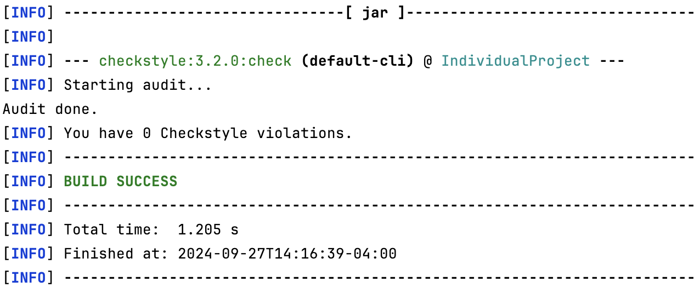
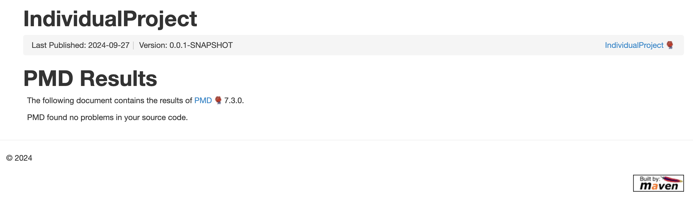

# COMS4156 Individual Miniproject
This is the GitHub repository for the Individual Miniproject in COMS4156 Advanced Software Engineering. This project is a web service built using Java and Spring Boot and deployed in the Google Cloud Platform (GCP). It offers features like managing courses and departments within an educational institution.

## Building and Running on Local Machine
To build and run the project locally, you would need:
- JDK 17: This project used JDK 17 for development, so it is recommended to use the same version. https://www.oracle.com/java/technologies/javase/jdk17-archive-downloads.html
- Maven 3.9.9: Please download and follow the instructions on https://maven.apache.org/download.cgi
- IntelliJ IDE: You can use any IDE, but it is recommended to use IntelliJ. The Community Edition can be downloaded for free. https://www.jetbrains.com/idea/download

Once you have all of the above, you can go ahead and clone the repository on your local device and navigate to the IndividualProject directory. Then, run `mvn -B package --file pom.xml` to build the project with Maven.

Next, you can run the main application by either running IndividualProjectApplication.java, which is located under 'IndividualProject/src/main' or entering the command `mvn spring-boot:run` in your terminal. You can also run the tests as described below.

## Accessing the Deployed Cloud Service
For a limited time, you can access the deployed version of this service on Google Cloud Platform. To check if the service is running, navigate your browser to the following endpoint: https://coms4156-miniproject.ue.r.appspot.com/

If the service is running, you should see a message like: "Welcome, in order to make an API call direct your browser or Postman to an endpoint This can be done using the following format: http:127.0.0.1:8080/endpoint?arg=value"

Once you checked that the service is running, then you can reach the other endpoints by appending them to the base URL. For example, to retrieve the details of the COMS department, you can navigate to https://coms4156-miniproject.ue.r.appspot.com/retrieveDept?deptCode=COMS.

Please note that this service may not always be active, but you can always run your own instance locally by following the instructions in the section above.

## Running Tests
There are unit tests located under the directory 'IndividualProject/src/test'. You can run any of the tests there, but before running the tests, make sure to build the project first. If you would like the run all the tests at once, you can use the following command: `mvn clean test`. After that, you can also generate the JaCoCo report using this command: `mvn jacoco:report`.

## Endpoints
This section describes the endpoints that this service provides, including their inputs and outputs.

### GET /retrieveDept
- Expected Input Parameters: deptCode (String)
- Expected Output: Returns the department details if found.
- Upon Success: HTTP 200 Status Code along with department details in the response body.
- Upon Failure:
  - HTTP 404 Status Code if the department is not found.
  - HTTP 500 Status Code if an error occurs.

### GET /retrieveCourse
- Expected Input Parameters: deptCode (String), courseCode (int)
- Expected Output: Returns the course details if found.
- Upon Success: HTTP 200 Status Code along with course details in the response body.
- Upon Failure:
  - HTTP 404 Status Code if either the course or the department is not found.
  - HTTP 500 Status Code if an error occurs.

### GET /retrieveCourses
- Expected Input Parameters: courseCode (int)
- Expected Output: Returns all courses with the specified course code across all departments.
- Upon Success: HTTP 200 Status Code along with details of all matching courses in the response body.
- Upon Failure:
  - HTTP 404 Status Code if no courses are found.
  - HTTP 500 Status Code if an error occurs.

### GET /isCourseFull
- Expected Input Parameters: deptCode (String), courseCode (int)
- Expected Output: Returns whether the course is full.
- Upon Success: HTTP 200 Status Code along with true or false in the response body.
- Upon Failure:
  - HTTP 404 Status Code if either the course or the department is not found.
  - HTTP 500 Status Code if an error occurs.

### GET /getMajorCountFromDept
- Expected Input Parameters: deptCode (String)
- Expected Output: Returns the number of majors in the department.
- Upon Success: HTTP 200 Status Code along with the major count in the response body.
- Upon Failure:
  - HTTP 404 Status Code if the department is not found.
  - HTTP 500 Status Code if an error occurs.

### GET /idDeptChair
- Expected Input Parameters: deptCode (String)
- Expected Output: Returns the name of the department chair.
- Upon Success: HTTP 200 Status Code along with the department chair's name in the response body.
- Upon Failure:
  - HTTP 404 Status Code if the department is not found.
  - HTTP 500 Status Code if an error occurs.

### GET /findCourseLocation
- Expected Input Parameters: deptCode (String), courseCode (int)
- Expected Output: Returns the location of the course.
- Upon Success: HTTP 200 Status Code along with the course location in the response body.
- Upon Failure:
  - HTTP 404 Status Code if either the course or the department is not found.
  - HTTP 500 Status Code if an error occurs.

### GET /findCourseInstructor
- Expected Input Parameters: deptCode (String), courseCode (int)
- Expected Output: Returns the instructor of the course.
- Upon Success: HTTP 200 Status Code along with the instructor's name in the response body.
- Upon Failure:
  - HTTP 404 Status Code if either the course or the department is not found.
  - HTTP 500 Status Code if an error occurs.

### GET /findCourseTime
- Expected Input Parameters: deptCode (String), courseCode (int)
- Expected Output: Returns the course's time slot.
- Upon Success: HTTP 200 Status Code along with the course time slot in the response body.
- Upon Failure:
  - HTTP 404 Status Code if either the course or the department is not found.
  - HTTP 500 Status Code if an error occurs.

### PATCH /addMajorToDept
- Expected Input Parameters: deptCode (String)
- Expected Output: Adds one student to the department's major count.
- Upon Success: HTTP 200 Status Code indicating that the major count has been updated.
- Upon Failure:
  - HTTP 404 Status Code if the department is not found.
  - HTTP 500 Status Code if an error occurs.

### PATCH /removeMajorFromDept
- Expected Input Parameters: deptCode (String)
- Expected Output: Removes one student from the department's major count if it is greater than zero. If not, leaves the major count as it is.
- Upon Success: HTTP 200 Status Code indicating that the major count has been updated or is already at minimum.
- Upon Failure:
  - HTTP 404 Status Code if the department is not found.
  - HTTP 500 Status Code if an error occurs.

### PATCH /dropStudentFromCourse
- Expected Input Parameters: deptCode (String), courseCode (int)
- Expected Output: Drops a student from the course.
- Upon Success: HTTP 200 Status Code indicating that the student has been dropped.
- Upon Failure:
  - HTTP 400 Status Code if the course has no enrolled students.
  - HTTP 404 Status Code if either the course or the department is not found.
  - HTTP 500 Status Code if an error occurs.

### PATCH /enrollStudentInCourse
- Expected Input Parameters: deptCode (String), courseCode (int)
- Expected Output: Enrolls a student in the course.
- Upon Success: HTTP 200 Status Code indicating that the student has been enrolled.
- Upon Failure:
  - HTTP 400 Status Code if the course is full.
  - HTTP 404 Status Code if either the course or the department is not found.
  - HTTP 500 Status Code if an error occurs.

### PATCH /setEnrollmentCount
- Expected Input Parameters: deptCode (String), courseCode (int), count (int)
- Expected Output: Sets the new enrollment count for the course. It is acceptable for the enrollment count to be set above the capacity, but this will be indicated in the response body.
- Upon Success: HTTP 200 Status Code if the count is set successfully.
- Upon Failure:
  - HTTP 400 Status Code if the count is invalid.
  - HTTP 404 Status Code if either the course or the department is not found.
  - HTTP 500 Status Code if an error occurs.

### PATCH /changeCourseTime
- Expected Input Parameters: deptCode (String), courseCode (int), time (String)
- Expected Output: Updates the course's time slot.
- Upon Success: HTTP 200 Status Code if the time slot is updated successfully.
- Upon Failure:
  - HTTP 400 Status Code if the time slot is invalid.
  - HTTP 404 Status Code if either the course or the department is not found.
  - HTTP 500 Status Code if an error occurs.

### PATCH /changeCourseTeacher
- Expected Input Parameters: deptCode (String), courseCode (int), teacher (String)
- Expected Output: Updates the course's instructor.
- Upon Success: HTTP 200 Status Code if the instructor is updated successfully.
- Upon Failure:
  - HTTP 400 Status Code if the instructor's name is invalid.
  - HTTP 404 Status Code if either the course or the department is not found.
  - HTTP 500 Status Code if an error occurs.

### PATCH /changeCourseLocation
- Expected Input Parameters: deptCode (String), courseCode (int), location (String)
- Expected Output: Updates the course's location.
- Upon Success: HTTP 200 Status Code if the location is updated successfully.
- Upon Failure:
  - HTTP 400 Status Code if the location is invalid.
  - HTTP 404 Status Code if either the course or the department is not found.
  - HTTP 500 Status Code if an error occurs.

## Code Checks
You can check the style of the code and generate style checking reports using the following command: `mvn checkstyle:check`. This will show any style violations in your terminal and generate a report called checkstyle-result.xml inside 'IndividualProject/target'. 

Here is the latest report as of 09/27/2024. 



You can also run PMD to perform static analysis by running the following command: `mvn pmd:check`. The rulesets that will be used are the error-prone and default rulesets, which are configured like below in the pom.xml file. The results will be generated in a file named pmd.xml inside 'IndividualProject/target' and pmd.html inside 'IndividualProject/target/reports'.

```
<plugin>
    <groupId>org.apache.maven.plugins</groupId>
    <artifactId>maven-pmd-plugin</artifactId>
    <version>3.25.0</version>
    <configuration>
        <rulesets>
            <ruleset>/category/java/errorprone.xml</ruleset>
            <ruleset>/rulesets/java/maven-pmd-plugin-default.xml</ruleset>
        </rulesets>
    </configuration>
</plugin>
```

Here is the latest result of running PMD as of 09/27/2024.



## Continuous Integration Report
This respository uses GitHub Actions to perform continuous integration. You can view the latest results here: https://github.com/jonghyun-joann-lee/4156-Miniproject/actions/workflows/maven.yml

## Tools Used
These are the tools used in developing this project.
- Maven Package Manager
- GitHub Actions CI
- Checkstyle
- PMD
- JaCoCo
- Bruno (for testing that the APIs work)